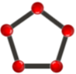
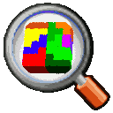
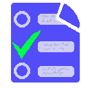
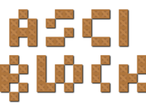

# guerratron.github.io
guerratron github web site  

# PROYECTS:
Guerratron GitHub last proyects

## DOMbasic:
>
>PHP package to create dynamic __DOM__ elements.  
>It follow the __OOP__ paradigm, implemented __SINGLETON__ patterns, _magical_ methods, contains error control ('own exceptions'), _chaining_ methods, optimized memory and resources, ...  

## CanvasShapes:
>
> It is a library for drawing geometric figures associated events, allows drawing the flat geometric shapes over the **canvas** *HTML* element.  
> It shows geometric calculations (areas, perimeters, ...) and supports a free drawn mode *"freehand"*; also it has a graphical interface with buttons bar and an options window where display / modify some of the multiple parameters supported.  

## rsLIB:
>
> It's a *HTML* **scripts** loader.  
> This inserts the linked-scripts parameters in the HTML-HEAD section DYNAMIC and SYNCHRONOUSLY, but without AJAX. It loads Scripts (js, json, ...) and even style sheets (CSS).

## Doctron:
>
> The **doctron** is a (javascript) *'jsDoc'* template. It is based in **Default template**.  
> This template has been given a more updated and modern touch, respecting standards and minified some files to load (were deleted the added fonts). It will has incorporated some new features to enhance functionality. It is more versatile than its predecessor by incorporating more configuration options, thus increasing the customization possibility.

## WrapperTracer:
>
> It is a class that creates **Javascript** *wrapper* objects to allow *tracking* of the executed methods.  
> It serve of **TRACER** to obtain a visual representation of methods's execution cycle, as help with information (elapsed time, nesting, methods type, parameters, ...) 

## Testron:
>
> It is a **Javascript API** to perform questions of *test* type.  
> **Testron** can be used as a preparatory method for academic exams. You only need the question file with a valid structure. This file can be **JSON format** (object or string) or **Javascript Object** with one declared variable.  

## JSduino:
>
> 'JSduino' (web-app) is a great **Arduino simulator** in JS.  
> It is a web-app written in '*JavaScript*' that emulates an arduino board (**UNO R3**) with the representation of its input and output pins, and the possibility of inserting buttons that act on those pins. These buttons are actuators that can behave like Switches, NO pushbuttons, NC pushbuttons, push-switches, ... or also receivers such as LEDs and sensors.  

## Ascii-Block:
>
> It is a 3D game, it's a *Pseudo-Pacman* 3D game, with possibility of design for develop levels  from a text file (*ASCII*).  
> The interesting thing is that this is a creative game, not just playful. By creating levels here we are building a virtual virtual world where it is more fun to play and the possibilities and difficulty are set by ourselves.  
> It is designed for two players, this depends on the design of the level; A small buttons menu is also included in the display for the main options. We also have several visual effects and sounds.  

> Author: 
